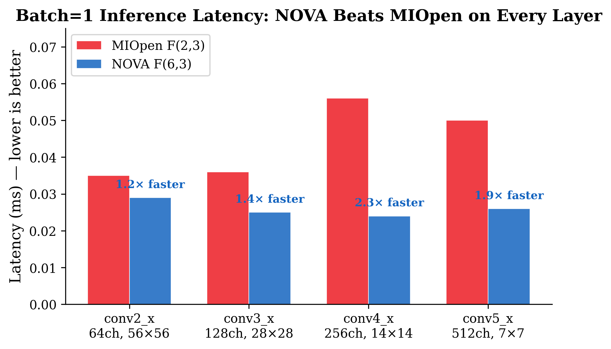

# NOVA Winograd F(6,3) for AMD MI300X

**Production-quality large-tile Winograd convolution in FP16 that beats MIOpen.**

NOVA uses optimized interpolation points to make F(6,3) Winograd numerically stable in half-precision — solving the exact instability that caused AMD, NVIDIA, and every major framework to abandon large-tile Winograd.

## Key Results (AMD Instinct MI300X)

| Metric | Result |
|--------|--------|
| **Batch=1 latency vs MIOpen F(2,3)** | **NOVA wins by 17–57%** |
| ImageNetV2 top-1 accuracy | 63.29% (baseline 63.15%) |
| Standard F(6,3) FP16 accuracy | 31.07% (221K NaN — broken) |
| Stable Diffusion 1.5 UNet | 49/49 layers, 0.98x MIOpen, valid images |
| NaN / Inf | **Zero** |

<p align="center">
  
</p>

## Quick Start

### Build

```bash
# Requires: AMD GPU (gfx942), ROCm, PyTorch with ROCm support
make
```

### Use

```python
from nova_winograd import replace_conv2d_with_nova

model = torchvision.models.resnet50(pretrained=True).cuda().half()
replace_conv2d_with_nova(model)   # Replaces 13 eligible Conv2d layers
output = model(input_fp16)         # Uses NOVA F(6,3) automatically
```

### Test

```bash
make test    # 11 correctness tests
make bench   # Performance vs MIOpen
```

## Installation

```bash
git clone https://github.com/jayantsh/nova-wino-amd.git
cd nova-wino-amd
pip install -e .
make          # Builds HIP kernel → nova_winograd/lib/libnova_winograd.so
```

### Requirements

- AMD Instinct GPU (tested on MI300X, gfx942)
- ROCm 6.3+ with rocBLAS
- PyTorch 2.x with ROCm support
- hipcc (from ROCm toolkit)

## Architecture

```
Input [B,C,H,W]  →  Input Transform (HIP)  →  rocBLAS Batched GEMM  →  Output Transform (HIP)  →  Output [B,K,H,W]
                     B^T · tile · B              64× [K,C]·[C,P]          A · M · A^T
                     wave shuffles               FP32 accumulate          wave shuffles
                     zero LDS                    via MFMA                 zero LDS
```

- **Transforms**: Custom HIP kernels, 4 tiles/workgroup (256 threads), register-only via `__shfl`
- **GEMM**: rocBLAS `gemm_strided_batched_ex` — FP16 in, FP32 accumulation, FP16 out
- **Filter transform**: Computed once, cached across forward passes

## API Reference

### Modules

| Class | Use Case |
|-------|----------|
| `NovaWinogradConv2d` | Inference (workspace caching, weight versioning) |
| `NovaWinogradConv2dTrainable` | Training (HIP forward, FP32 native backward) |
| `NovaWinogradConv2dCompilable` | `torch.compile(fullgraph=True)` compatible |

### Functions

| Function | Description |
|----------|-------------|
| `replace_conv2d_with_nova(model)` | Replace all eligible 3x3 s1 Conv2d layers in-place |
| `nova_forward(input_fp16, weight_fp32, padding)` | Functional API for single forward pass |
| `NovaWinogradConv2d.from_conv2d(conv)` | Create from existing nn.Conv2d (copies weights) |

## Repository Structure

```
nova-wino-amd/
├── csrc/
│   └── nova_winograd.hip          # HIP kernels + host class + C API (906 lines)
├── nova_winograd/
│   ├── __init__.py                 # Package exports
│   ├── ops.py                      # ctypes bridge to .so
│   ├── conv2d.py                   # nn.Module implementations
│   ├── surgery.py                  # replace_conv2d_with_nova()
│   └── lib/                        # Built .so goes here
├── tests/
│   └── test_correctness.py         # 11 pytest tests
├── benchmarks/
│   ├── bench_layers.py             # Per-layer performance vs MIOpen
│   └── bench_sd_unet.py            # Stable Diffusion UNet demo
├── examples/
│   ├── quickstart.py               # Three usage patterns
│   └── resnet50_inference.py       # ResNet-50 with NOVA
├── docs/
│   └── report/                     # Technical report (LaTeX + PDF)
├── Makefile
├── setup.py
└── README.md
```

## Performance

### Batch=1 (Latency-Critical Inference)

| Layer | MIOpen F(2,3) | NOVA F(6,3) | Speedup |
|-------|:------------:|:-----------:|:-------:|
| conv2_x (64ch, 56x56) | 0.035 ms | **0.029 ms** | 1.2x |
| conv3_x (128ch, 28x28) | 0.036 ms | **0.025 ms** | 1.4x |
| conv4_x (256ch, 14x14) | 0.056 ms | **0.024 ms** | 2.3x |
| conv5_x (512ch, 7x7) | 0.050 ms | **0.026 ms** | 1.9x |

### Batch > 1

MIOpen's fused single-kernel F(2,3) wins at larger batches (1.5–4.2x). The gap narrows with `fp16_alt_impl` (available in ROCm 7.x).

## Technical Report

Full technical report with figures, tables, and analysis:
[`docs/report/main.pdf`](docs/report/main.pdf)

## License

Copyright (c) 2026 Jayant Lohia. All rights reserved. See [LICENSE](LICENSE).

## Citation

If you use NOVA Winograd in your work, please cite the NOVA paper on arXiv.
